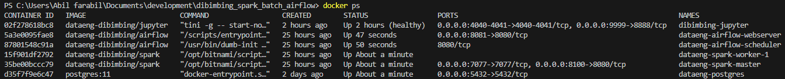
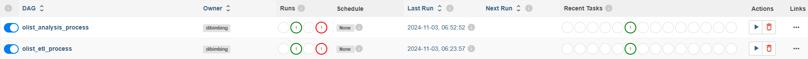
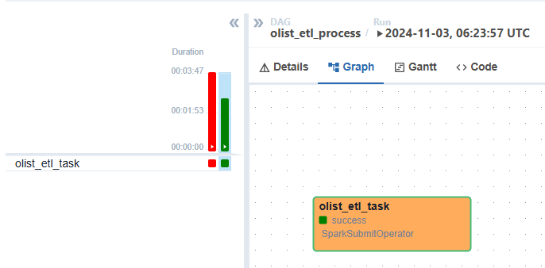
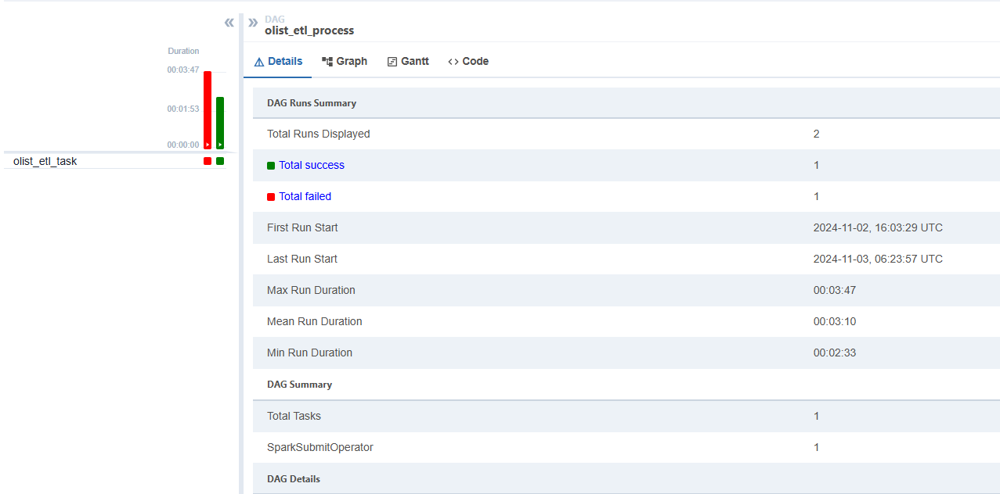
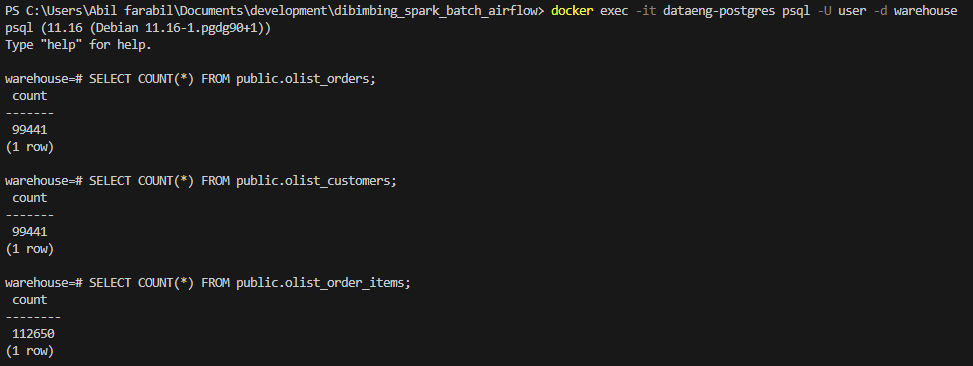
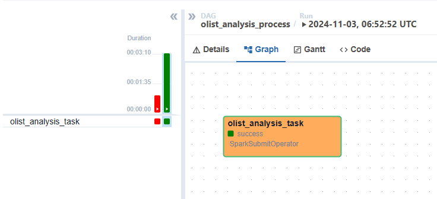
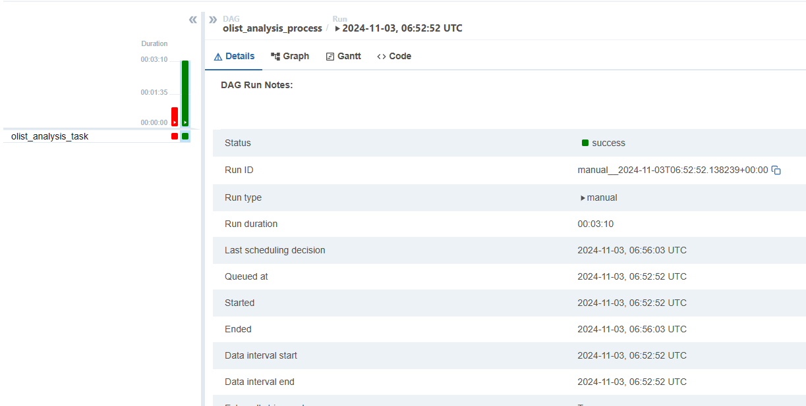
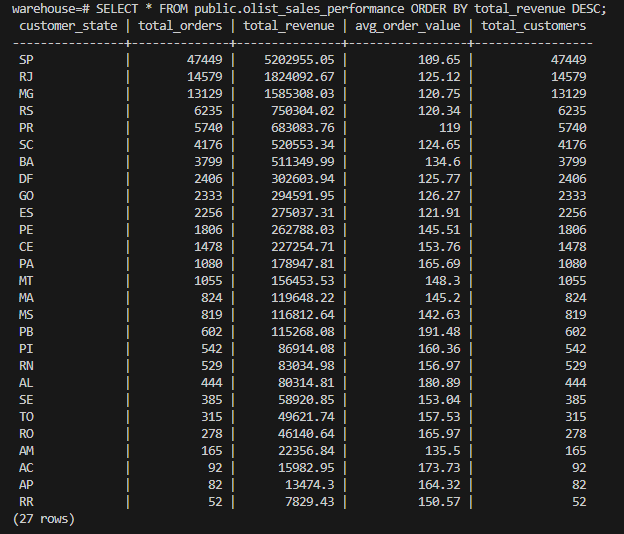

# Olist ETL Batch Processing

## Ringkasan
Proyek ini mengimplementasikan pipeline ETL (Extract, Transform, Load) batch processing untuk data e-commerce Olist menggunakan Apache Airflow, Apache Spark, dan PostgreSQL. Pipeline ini mengekstrak data dari file CSV, memuatnya ke PostgreSQL, dan melakukan analisis performa penjualan berdasarkan wilayah.

## Arsitektur


Proyek ini menggunakan tiga komponen utama:
- **Apache Airflow**: Untuk orkestrator alur kerja
- **Apache Spark**: Untuk pemrosesan data
- **PostgreSQL**: Untuk penyimpanan dan analisis data

## Komponen

### 1. Proses ETL
Proses ETL mengekstrak data dari file CSV Olist dan memuatnya ke dalam tabel PostgreSQL.

#### Tampilan DAG Airflow


#### Graph DAG ETL


#### Status Sukses ETL


#### Verifikasi Data


### 2. Proses Analisis
Proses analisis membaca data dari PostgreSQL dan melakukan analisis performa penjualan berdasarkan wilayah.

#### Graph DAG Analisis


#### Status Sukses Analisis


#### Hasil Analisis


## Persiapan Proyek

### Prasyarat
- Docker
- Docker Compose
- Make

### Persiapan Lingkungan
1. Clone repository
```bash
git clone https://github.com/abilfarabil/olist-etl-batch-processing.git
cd olist-etl-batch-processing
```

2. Menjalankan layanan
```bash
make postgres
make spark
make airflow
```

### Menjalankan Pipeline
1. Akses Airflow UI di `localhost:8081`
   - Username: airflow
   - Password: airflow

2. Aktifkan dan jalankan DAG secara berurutan:
   - `olist_etl_process`
   - `olist_analysis_process`

## Struktur Proyek
```
├── dags/                      # File-file DAG Airflow
├── data/                      # File-file data input
│   └── olist/                 # Dataset Olist
├── docker/                    # File konfigurasi Docker
├── logs/                      # File log
├── notebooks/                 # Jupyter notebooks
├── scripts/                   # Script utilitas
├── spark-scripts/            # Script pemrosesan Spark
│   └── jars/                 # File JAR yang diperlukan
└── sql/                      # Script SQL
```

## Teknologi yang Digunakan
- Apache Airflow
- Apache Spark (PySpark)
- PostgreSQL
- Docker
- Python

## Kontribusi
Silakan ajukan issues dan permintaan peningkatan fitur.

## Lisensi
[MIT License](LICENSE)